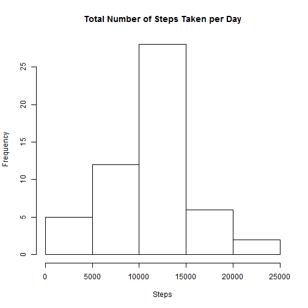
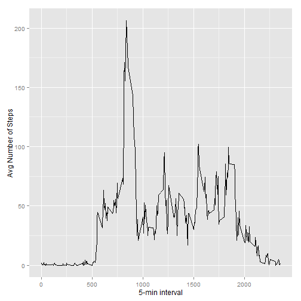
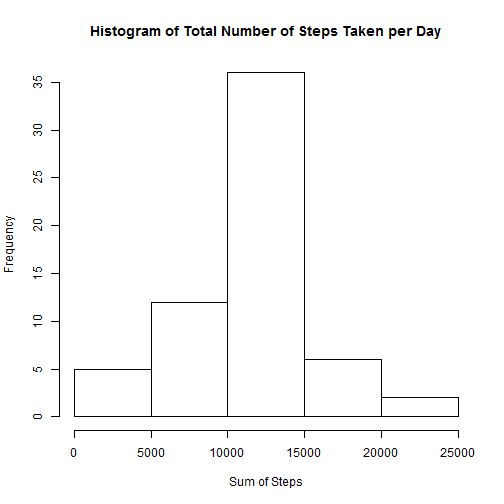
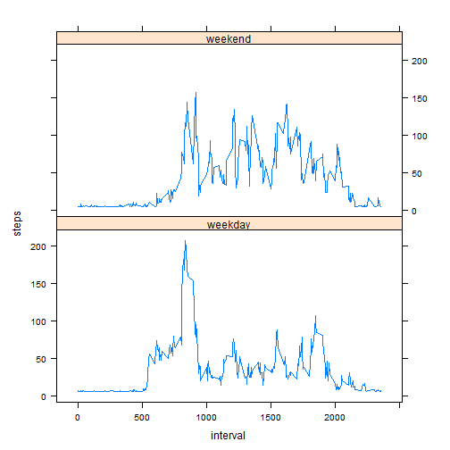

## Introduction
It is now possible to collect a large amount of data about personal movement using activity monitoring devices such as a Fitbit, Nike Fuelband, or Jawbone Up. These type of devices are part of the "quantified self" movement -- a group of enthusiasts who take measurements about themselves regularly to improve their health, to find patterns in their behavior, or because they are tech geeks. But these data remain under-utilized both because the raw data are hard to obtain and there is a lack of statistical methods and software for processing and interpreting the data.

This assignment makes use of data from a personal activity monitoring device. This device collects data at 5 minute intervals through out the day. The data consists of two months of data from an anonymous individual collected during the months of October and November, 2012 and include the number of steps taken in 5 minute intervals each day.

##Data
The data for this assignment can be downloaded from the course web site:
<https://d396qusza40orc.cloudfront.net/repdata%2Fdata%2Factivity.zip>

The variables included in this dataset are:

**steps**: Number of steps taking in a 5-minute interval (missing values are coded as NA)

**date**: The date on which the measurement was taken in YYYY-MM-DD format

**interval**: Identifier for the 5-minute interval in which measurement was taken

The dataset is stored in a comma-separated-value (CSV) file and there are a total of 17,568 observations in this dataset.


## Loading and preprocessing the data


```r
unzip(zipfile="repdata-data-activity.zip")
activity <- read.csv("activity.csv")
summary(activity)
```

```
##      steps                date          interval     
##  Min.   :  0.00   2012-10-01:  288   Min.   :   0.0  
##  1st Qu.:  0.00   2012-10-02:  288   1st Qu.: 588.8  
##  Median :  0.00   2012-10-03:  288   Median :1177.5  
##  Mean   : 37.38   2012-10-04:  288   Mean   :1177.5  
##  3rd Qu.: 12.00   2012-10-05:  288   3rd Qu.:1766.2  
##  Max.   :806.00   2012-10-06:  288   Max.   :2355.0  
##  NA's   :2304     (Other)   :15840
```

## What is mean total number of steps taken per day?

1. Histogram of the total number of steps taken each day

 

2. Calculate and report the mean and median total number of steps taken per day.


```r
total.steps <- tapply(activity$steps, activity$date, FUN=sum, na.rm=TRUE)
meanSteps <- mean(total.steps, na.rm=TRUE)
medianSteps <- median(total.steps, na.rm=TRUE)
print(paste0("Mean steps: ", meanSteps))
```

```
## [1] "Mean steps: 9354.22950819672"
```

```r
print(paste0("Median steps: ", medianSteps))
```

```
## [1] "Median steps: 10395"
```

## What is the average daily activity pattern?

1. Time series plot of the 5-minute interval (x-axis) and the average number of steps taken, averaged across all days (y-axis).


```r
library(ggplot2)
```

```
## Warning: package 'ggplot2' was built under R version 3.1.2
```

```r
Avg <- aggregate(x=list(steps=activity$steps), by=list(interval=activity$interval), FUN=mean, na.rm=TRUE)
ggplot(data=Avg, aes(x=interval, y=steps)) +
    geom_line() +
    xlab("5-min interval") +
    ylab("Avg Number of Steps")
```

 

2. Which 5-minute interval, on average across all the days in the dataset, contains the maximum number of steps?


```r
Avg[which.max(Avg$steps),]
```

```
##     interval    steps
## 104      835 206.1698
```


## Inputting missing values

1. Calculate and report the total number of missing values in the dataset (i.e. the total number of rows with NAs)


```r
sum(is.na(activity))
```

```
## [1] 2304
```


2. Devise a strategy for filling in all of the missing values in the dataset: 
Fill in the missing values with the mean value for that 5-minute interval.

3. Create a new dataset that is equal to the original dataset but with the missing data filled in.


```r
activity2 <- activity
activity2$steps[is.na(activity2$steps)] <- mean(activity2$steps, na.rm=TRUE)
```

4. Make a histogram of the total number of steps taken each day and Calculate and report the mean and median total number of steps taken per day. Do these values differ from the estimates from the first part of the assignment? What is the impact of imputing missing data on the estimates of the total daily number of steps?


```r
totalSteps <- tapply(activity2$steps, activity2$date, sum)
hist(totalSteps, main = paste("Histogram of Total Number of Steps Taken per Day"), xlab="Sum of Steps")
```

 

```r
newMean <-mean(totalSteps)
newMedian <- median(totalSteps)
```

The new mean is 1.0766189 &times; 10<sup>4</sup> . The new median is 1.0766189 &times; 10<sup>4</sup> . 
Imputing the missing data affects only the median, not the mean total number of steps.


## Are there differences in activity patterns between weekdays and weekends?

1. Create a new factor variable in the dataset with two levels -- "weekday" and "weekend" indicating whether a given date is a weekday or weekend day.


```r
activity2$day <- ifelse(as.POSIXlt(as.Date(activity2$date))$wday%%6 == 0, "weekend", "weekday")
activity2$day <- factor(activity2$day, levels=c("weekday", "weekend"))
```

2. Make a panel plot containing a time series plot (i.e. type = "l") of the 5-minute interval (x-axis) and the average number of steps taken, averaged across all weekday days or weekend days (y-axis). 


```r
library(lattice)
totbyDay <- aggregate(steps ~ interval + day, data=activity2, mean)
xyplot(steps ~ interval | factor(day), data=totbyDay, aspect=.5, type="l")
```

 


